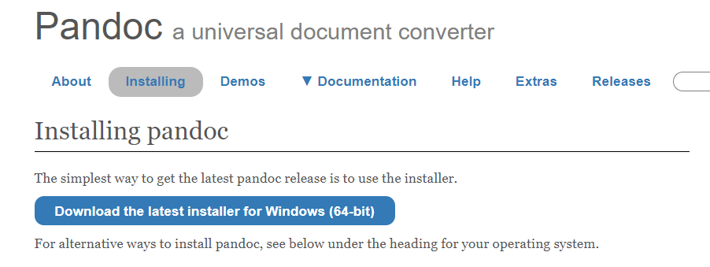
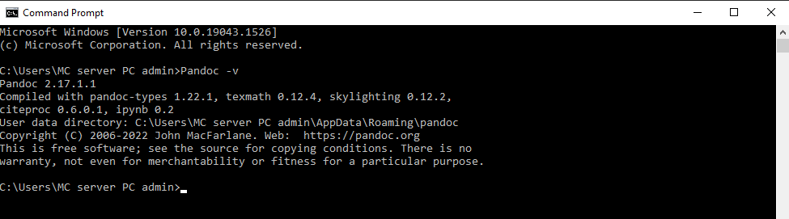

# How to Download and Install Pandoc

This section will guide your through installing Pandoc on your computer.

## Steps

1. Go to [pandoc.org](pandoc.org)
2. Click "installing" at the top of the page (highlighted in Figure 1)
3. Click download latest installer  
    **NOTE:** This screenshot was taken on a windows machine, if you are using Apple, install for MacOS
    <figure>
    
    <figcaption>Figure 1: The installing page</figcaption>
    </figure>
4. Run the executable that downloads
5. Check that Pandoc installed properly
   1. Open the Terminal (Mac) or Command Prompt (Windows)
   2. Enter the command ``Pandoc -v``
        <figure>
        
        <figcaption>Figure 2: Pandoc -v after a successful install</figcaption>
        </figure>
   3. The terminal should display your current version of Pandoc (example shown in Figure 2)

Pandoc should now be installed on your computer. You can now move to the next step where you use Pandoc to convert a word document into Markdown.


